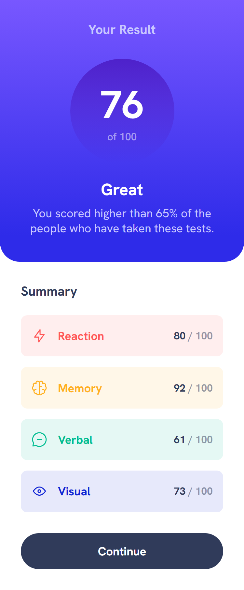
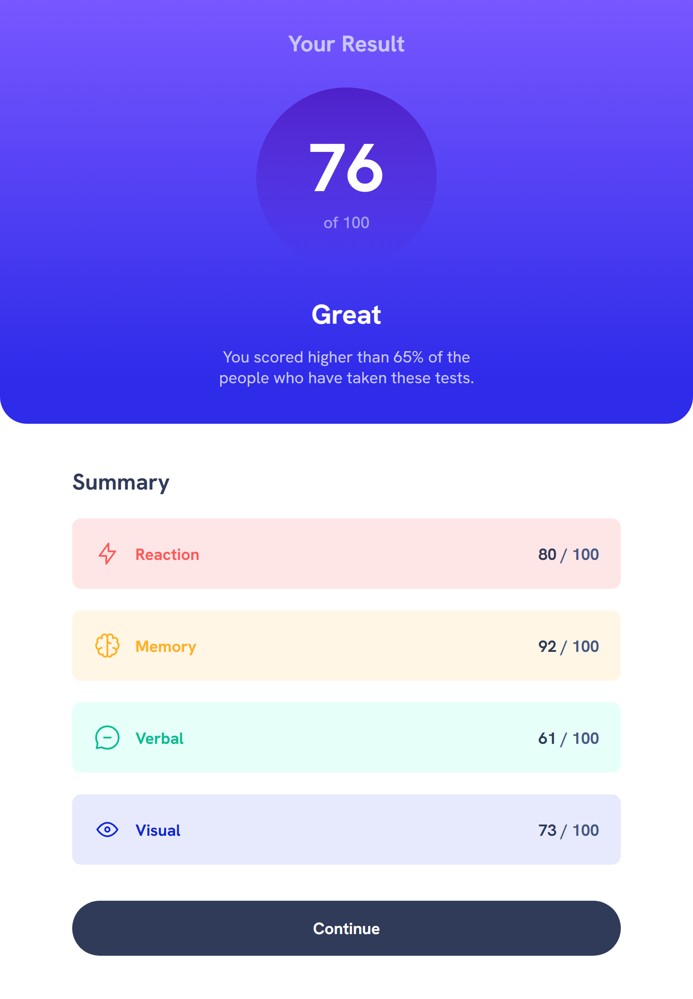
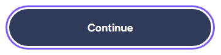

# Frontend Mentor - Results summary component solution

This is a solution to the [Results summary component challenge on Frontend Mentor](https://www.frontendmentor.io/challenges/results-summary-component-CE_K6s0maV).

## Table of contents

- [Overview](#overview)
  - [The challenge](#the-challenge)
  - [Screenshots](#screenshots)
    - [Responsive Layout](#responsive-layout)
    - [Hover states](#hover-states)
  - [Tests](#tests)
    - [Unit Tests](#unit-tests)
    - [Accessibility Tests](#accessibility-tests)
  - [Links](#links)
  - [My process](#my-process)
    - [Built with](#built-with)
- [Author](#author)

## Overview

### The challenge

Users should be able to:

- View the optimal layout for the interface depending on their device's screen size
- See hover and focus states for all interactive elements on the page

### Screenshots

#### Responsive Layout

This project features a responsive design, built with with a "mobile-first" approach.

1. Mobile layout

   1.1 Small Screens

      

   1.2 Tablet Screens

      

2. Desktop layout

   

#### Hover states

Continue Button:

- Hover state:

- Focus style:

### Tests

#### **Unit Tests**

This project uses Jest and React Testing Library for unit testing.

The unit tests cover:

- The rendering of the components.

#### **Accessibility Tests**

1. Automated Tests

- Run Lighthouse audits in Chrome and Edge DevTools (95 score).

2. Manual Tests

- Screen Reader testing with NVDA:
  - Checked that headings (h1, h2) are announced correctly.
  - Checked that all section content is announced correctly.
  - Checked that the continue link is read when focused.

### Links

- Solution URL: [https://github.com/f29pereira/results-summary-component](https://github.com/f29pereira/results-summary-component)
- Live Site URL: [https://f29pereira.github.io/results-summary-component/](https://f29pereira.github.io/results-summary-component/)

## My process

### Built with

- Semantic HTML5 markup
- CSS custom properties
- Flexbox
- Grid
- Mobile-first workflow
- [React](https://reactjs.org/) - JS library
- [Next.js](https://nextjs.org/) - React framework
- [TypeScript](https://www.typescriptlang.org/) - Strongly typed programming language that builds on JavaScript, giving better tooling at any scale
- [Jest](https://jestjs.io/) - JavaScript testing library
- [React Testing Library](https://testing-library.com/) - React components testing library
- [NVDA (NonVisual Desktop Access)](https://www.nvaccess.org/) - open-source screen reader for Windows

## Author

- Frontend Mentor - [@f29pereira](https://www.frontendmentor.io/profile/f29pereira)
